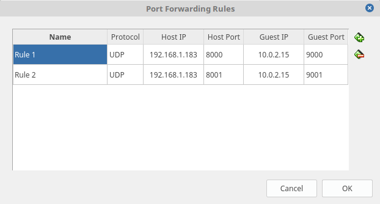

# **EE 250L Spring 2018 Lab 04 Part 2**

In part 2, we will switch over to the UDP protocol and communicate between your
VM and your Raspberry Pi over the Wireless Local Area Network (WLAN) using
sockets. Every machine/device typically has a single IP address. To send packets 
to a specific process on a machine, you need to use *ports* at the transport
layer (or L4). The examples we will run here will illustrate how ports work.

## Step 1:

Read through the scripts in the directory. Open up two terminals in your VM and 
run both of the server scripts without modification, each in a different 
terminal:

    python3 udpServer1.py
    python3 udpServer2.py

**Question 1**: What happens when you try to run both server scripts? Explain.
Copy-paste the output into your lab answer sheet.

## Step 2:

Stop any running instances of the server scripts by clicking anywhere inside the
terminal window to bring it into focus and pressing `Ctrl+c`. This sends the 
SIGINT signal to the process to tell it to stop.

Edit the two server scripts to listen in on two different ports in the 9000s 
range. This is an uncommon range of ports, so they should all be free. Run both 
server scripts. 

**Question 2**: Open a third terminal and run the client script 
(`python3 udpClient.py`). Make sure not to run with sudo rights. What happens? 
Copy-paste teh output into your lab answer sheet. Then, change the `port` 
variable to 1024, and run the script. What happens? Google around to explain 
what is going on.

Stop the instance of `udpClient.py` using `Ctrl+c`. Change `port` in the client
script to 5001 and run the client script. Use the client script to send messages
to the two different UDP servers you insantiated by inputting the port numbers 
you set for the UDP server scripts.

## Step 3:

Now, we'll run the code on two separate machines (your VM and rpi). Don't worry 
about pushing any of your changes. We'll do this manually using a text editor
on your rpi. Login to your rpi and clone this repository under the directory you 
have been using for the RIOT-EE250 labs. Remember, this step is important 
because the rpis may be used by someone else!

In this step, we want to send packets from your rpi to your VMs over the local area network 
to your rpi. To do this, you need the script on the VM to listen (or bind) to 
the VM's LAN IP. In the SSH session with your rpi, type `ifconfig`. Figure out
which numbers are the rpi's LAN IPv4 address and write it down somewhere. Open a
terminal in your VM and run `ifconfig`. Figure out the LAN IPv4 address of your 
VM from the output. Take a look and mentally note the differences between the 
two IP addresses.

**Question 3**: In your answer sheet, list out the IPv4 address of your VM and
rpi. 

Understand:

The default networking mode of VirtualBox is to enable something called a 
Network Address Translator (NAT). This is how the routers you use at home work.
Most commercial routers allocate private Local Area Network IP addresses to 
connected devices that look something like `192.168.1.100`. This is how our
our class router behaves. Since LAN IPs are internal IP addresses,
you would not be able to connect to any device behind a router network from the
Internet by using these address. Instead, you would need to use the Wide Area
Network (WAN) address (aka the static or dynamic IP allocated by your Internet
Service Provider (ISP)). However, this is not straight forward because trying 
to connect to a WAN address will actually lead to connecting to just the router.
To address a specific device behind a router, you would need to setup something 
called **port forwarding** in a router's firmware.

Since VirtualBox also creates another NAT, you may see that your VM's IP address
looks something like `10.0.2.15`. As an *analogy*, this behavior is similar to 
plugging a router into another router like in the figure below.

{:height="36px" width="36px"}

In this picture, there is a double NAT. Devices connected to Router 1 will not
be able to connect to devices connected to Router 2 without setting up 
**port forwarding** on Router 2. However, devices connected to Router 2 will 
still be able connect to devices connected to Router 1 because of the typical 
default settings of routers out of the box. Going back to our situation of 
VirtualBox running a NAT, we need to setup port forwarding so your RPi can 
connect to your VM.

VirtualBox Port Forwarding:

Find the VirtualBox network settings for your VM and add two port forwarding 
rules, one for each UDP server script. You should not have to shutdown or 
restart your VM, but doing so may help you debug any issues. Below is an example
setup followed by a set of port forwarding rules:

 * Host OS IP: 192.168.1.183
 * VM IP: 10.0.2.15
 * udpServer1.py listening port: 9000
 * udpServer2.py listening port: 9001

 

Note the use of port 8000 and 8001 under the Host Port column. Please use these
two ports for your rules. Once you have your port forwarding rules set, 
you can try to run all three scripts. On your VM, set the `host` variable in 
both server scripts to the IPv4 address of your VM (e.g. 10.0.2.15 for the 
example setup above). Also, change the port numbers to be the two different 
numbers in the 9000s range you used in your port forwarding rules. Then, run 
both server scripts in separate terminals. In the terminal with the SSH session 
to your rpi, change the `host` variable in `udpClient.py` to your rpi's IP 
address and change the `server` variable to your host OS's IP address (NOT your 
VM's IP Address). Run `python3 udpClient.py` and try to send a message to the 
two processes running on your VM by using **ports 8000 and 8001**. If you are 
successful, move on to part 3.
